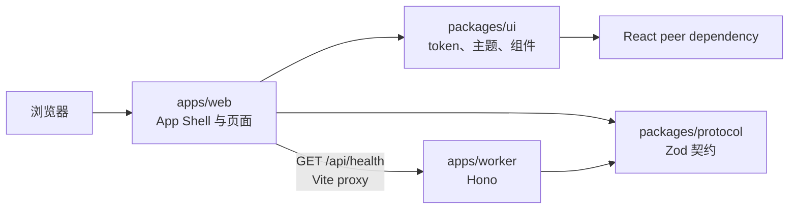
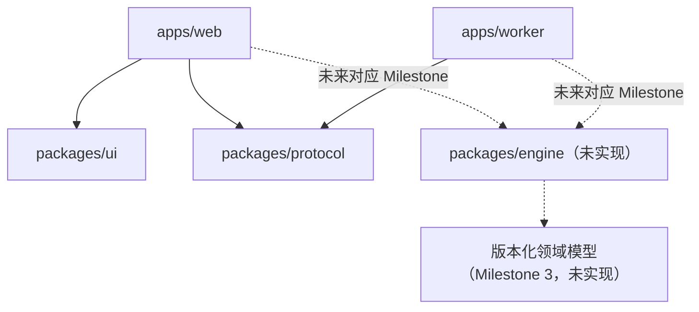

# 架构

## 当前架构（Milestone 2）

- `apps/web`：React/Vite 客户端，负责路由、App Shell、页面、主题入口和健康状态展示。
- `apps/worker`：Hono Cloudflare Worker，只提供 `/api/health`。
- `packages/ui`：无业务状态的设计 token、主题和通用 React 组件。
- `packages/protocol`：Web 与 Worker 共用的 Zod API 契约。
- `packages/config-*`：共享工程配置，不包含产品逻辑。
- `e2e`：真实浏览器 E2E、axe 与 smoke 测试。

## App Shell

App Shell 是 Web 的持久外框，包含 Top Bar、品牌、区域标题、主导航、主题菜单、Help Dialog、Skip Link 与移动底部导航。路由内容位于唯一 `main` landmark 中；路径变化时更新页面 title，并将焦点移动到主内容。

- `/` 为 Home。
- `/workspace` 为静态布局预览，不含数据模型或编辑能力。
- `/components` 为路由级 lazy-loaded 设计系统验收页。
- `*` 为路由级 lazy-loaded Not Found。

Workspace 与 Components 均按路由拆分，避免其全部实现进入首页初始 chunk。`/components` 在生产构建保留，作为无额外服务的验收面。

## Token 与主题

`packages/ui/src/styles/tokens.css` 是语义 token 的权威来源。组件只消费 `--ag-color-*`、`--ag-space-*`、`--ag-layout-*` 等语义变量。Tailwind 4 的 `@theme inline` 映射到这些变量，不建立第二套颜色事实源。

主题偏好为 `system | light | dark`，只存储在 `localStorage`。`theme-init.js` 在 React 之前解析偏好，`ThemeProvider` 负责运行时切换和系统主题变化监听。暗色主题采用重新设计的低亮度表面与独立状态色，不做机械反转。

## apps 与 packages 边界

- `apps` 是可运行入口，可以依赖 `packages`。
- `packages` 不得依赖任何 `apps`。
- Web 可依赖 UI 和 Protocol，但不得导入 Worker 内部实现。
- Worker 可依赖 Protocol，但不得导入 Web 或 UI。
- UI 不得依赖 Web、Worker、Protocol 或未来领域模型。
- Protocol 只容纳跨边界契约，不容纳 UI、运行时处理器或领域占位类型。

允许的依赖方向：

禁止的反向依赖：

- `packages/ui → apps/web | apps/worker`
- `packages/protocol → 任意 app`
- `apps/worker → apps/web | packages/ui`
- `apps/web → apps/worker 内部实现`
- 未来 `packages/engine → React | Hono | Cloudflare runtime | 网络 | 数据库`

## 本地开发数据流

1. 浏览器访问 `http://127.0.0.1:5173`。
2. Vite 返回 Web App Shell。
3. Web 以相对路径请求 `/api/health`。
4. Vite proxy 转发到 `http://127.0.0.1:8787`。
5. Worker 动态生成时间戳，用 `HealthResponseSchema` 验证并返回 JSON。
6. Web 用同一 schema 安全解析，映射到 loading、healthy 或 unavailable。

`VITE_API_ORIGIN` 可覆盖 API origin，为未来拆分部署保留边界；当前不部署。

## 未来目标架构

未来核心引擎必须是独立、纯 TypeScript、确定性、无框架依赖的 package。Milestone 2 只记录该边界，没有创建 Engine、World、Rule、Cell 或文件格式占位实现。
