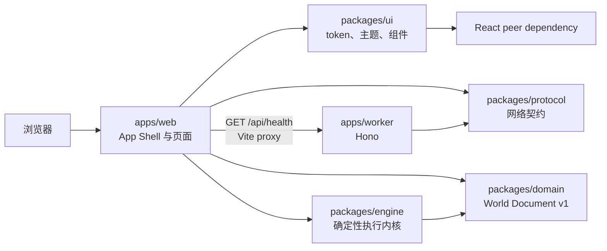
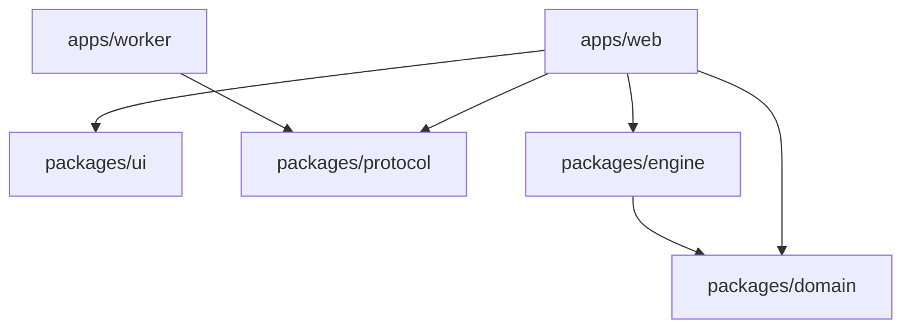
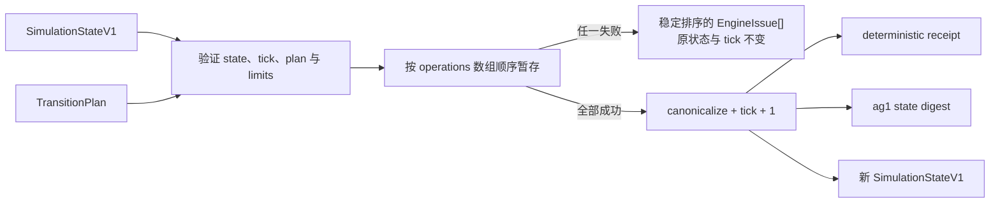

# 架构

## 当前架构（Milestone 4）

- `apps/web`：React/Vite 客户端，负责路由、App Shell、页面组合与健康状态展示。
- `apps/worker`：Hono Cloudflare Worker，仅提供 `/api/health`。
- `packages/ui`：无业务状态的设计 token、主题和通用 React 组件。
- `packages/protocol`：Web 与 Worker 共用的 Zod 网络契约。
- `packages/domain`：无框架依赖的 World Document v1 schema、验证、规范化、规范序列化与迁移。
- `packages/engine`：依赖 Domain 的纯 TypeScript 确定性模拟内核；包含 canonical state、纯数据 TransitionPlan、原子提交、receipt、snapshot 与稳定摘要。
- `packages/config-*`：共享工程配置，不包含产品逻辑。
- `e2e`：真实浏览器 E2E、axe 与 smoke 测试。

## App Shell

App Shell 是 Web 的持久外框，包含 Top Bar、品牌、区域标题、主导航、主题菜单、Help Dialog、Skip Link 与移动底部导航。路由内容位于唯一 `main` landmark 中；路径变化时更新页面 title，并将焦点移动到主内容。

- `/`：Home。
- `/workspace`：静态布局预览，不包含编辑能力。
- `/components`：lazy-loaded 设计系统验收页。
- `/world-format`：lazy-loaded World Document v1 验证实验室。
- `/engine`：lazy-loaded Engine Playground，只执行内置的纯数据 TransitionPlan。
- `*`：lazy-loaded Not Found。

非首页页面按路由拆分，避免进入首页初始 chunk。`/components` 保留在生产构建中，作为无额外服务的设计系统人工验收入口。

## Token 与主题

`packages/ui/src/styles/tokens.css` 是语义 token 的权威来源。组件消费 `--ag-color-*`、`--ag-space-*`、`--ag-layout-*` 等变量；Tailwind 4 的 `@theme inline` 映射这些变量，不建立第二套颜色事实源。

主题偏好为 `system | light | dark`，仅存储在 `localStorage`。`theme-init.js` 在 React 前解析偏好，`ThemeProvider` 负责运行时切换和系统主题变化监听。暗色主题使用低亮度表面与独立状态色，而非机械反转。

## apps 与 packages 边界

- `apps` 是可运行入口，可以依赖 `packages`；`packages` 不得依赖任何 `apps`。
- Web 可依赖 UI、Protocol、Domain 与 Engine，但不得导入 Worker 内部实现。
- Worker 当前只依赖 Protocol，不依赖 Web、UI、Domain 或 Engine。
- Engine 只依赖 Domain 和轻量纯 TypeScript 依赖，不依赖 React、UI、Web、Worker、Protocol 或 Cloudflare runtime。
- Domain 不依赖 Engine、Protocol、UI、React、Worker、Web 或 Cloudflare runtime。
- UI 不依赖 Domain 或 Engine，也不重新导出领域类型。
- Protocol 只容纳跨网络边界契约，不容纳 UI、执行器或领域占位类型。

允许的核心依赖方向：

禁止的反向依赖包括：

- `packages/ui → Domain | Engine | apps`
- `packages/protocol → Domain | Engine | apps`
- `packages/domain → Engine | Protocol | UI | apps`
- `packages/engine → UI | Web | Worker | Protocol | React | Hono | Cloudflare runtime`
- `apps/worker → apps/web | packages/ui`
- `apps/web → apps/worker` 内部实现

## 本地开发数据流

1. 浏览器访问 `http://127.0.0.1:5173`。
2. Vite 返回 Web App Shell。
3. Web 以相对路径请求 `/api/health`。
4. Vite proxy 转发到 `http://127.0.0.1:8787`。
5. Worker 动态生成时间戳，使用 `HealthResponseSchema` 验证并返回 JSON。
6. Web 使用同一 schema 解析，并映射到 loading、healthy 或 unavailable。

`VITE_API_ORIGIN` 可覆盖 API origin，为未来拆分部署保留边界；当前不部署。

## World Document 数据流

```mermaid
flowchart LR
  Text["用户粘贴的 UTF-8 JSON 文本"] --> Size["UTF-8 byte size"]
  Size --> Syntax["JSON syntax 与 object root"]
  Syntax --> Version["format / schemaVersion"]
  Version --> Schema["strict Zod schema"]
  Schema --> Semantic["ID、引用、坐标、时间、唯一性"]
  Semantic --> Normalize["安全 normalization"]
  Normalize --> Canonical["canonical World Document"]
  Canonical --> Initial["createInitialSimulationState"]
  Initial --> State["canonical SimulationStateV1"]
```

World Format Lab 只负责文本输入与 issue 展示，不复制 schema、上传、保存、渲染或执行输入。Domain 不访问文件系统、网络、存储、环境变量、系统时间或隐式随机源。

## Engine 状态模型

Canonical State 是比较、快照、摘要和确定性执行的唯一事实源。它只含普通 JSON-compatible 数据，并固定排序：

- symbols 按 ID；
- layers 按 order、ID；
- cells 与 entities 按 layer order、y、x、ID；
- properties key 与 tags 使用明确的 code-unit 比较规则。

Derived Indexes（例如 `entityById`、`entitiesByCoordinate`）只能从 canonical state 重建，不参与摘要，也不作为持久化格式。调用方通过 selector 取得防御性副本，不能依赖内部 `Map`。

## TransitionPlan 执行流

TransitionPlan 是内部、低层、纯数据的原子变更计划，不是 Rule、Condition、Action DSL 或用户文件格式。

后续 operation 可以观察前序 operation 的暂存结果；只有整个计划通过时才提交。空计划是合法 no-op tick。Receipt 仅记录 tick、操作 ID、计数、摘要前后值和结构化变化计数，不包含时钟时间或执行耗时。

## Snapshot 与摘要

Snapshot 包含版本、SimulationState 和摘要，使用普通 JSON-compatible data。恢复时重新验证状态并核对摘要；摘要不匹配时拒绝恢复。当前 `ag1:` 摘要使用纯 TypeScript FNV-1a 64-bit，对 canonical compact JSON 加 LF 计算，跨 Node、浏览器、Windows 和 Linux 保持一致。

摘要只用于一致性、缓存和测试，不是密码学签名，不能用于认证或对抗篡改。算法变化必须使用新前缀，不得静默改变 `ag1`。

## Domain、Engine 与未来规则边界

- Protocol 管理 Web/Worker 网络 API contract，当前主要是 health。
- Domain 管理可序列化世界文件及其可信化边界，不包含运行时执行细节。
- Engine 接受已验证的 Domain world，创建不可变运行状态并应用预计算 TransitionPlan。
- 未来规则层可以读取经过验证的 Domain/Engine 输入并产生 TransitionPlan，但不能让 Engine 接受 callback、代码字符串、表达式或自定义执行器。
- Engine 的 SimulationState、receipt、snapshot 与摘要不能反向污染 World Document v1。

Milestone 4 没有 Rule、Condition、Action、自动 transition 生成、碰撞、Canvas、编辑器、时间线或 replay 历史；这些只能由后续正式 Milestone 引入。
