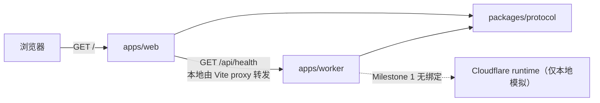
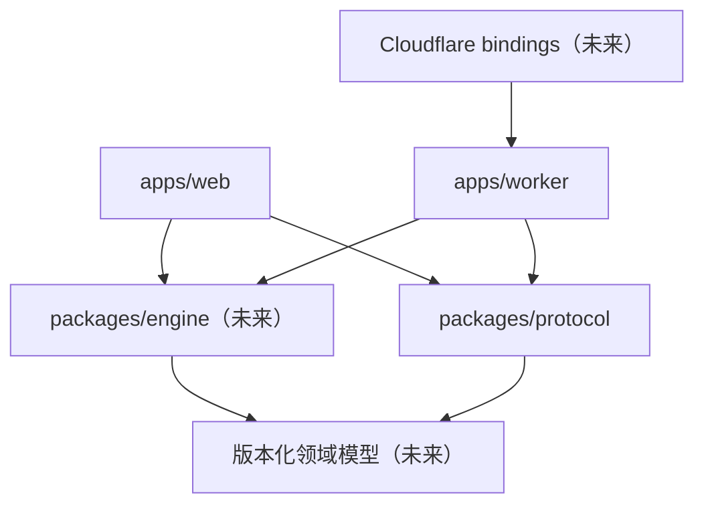

# 架构

## 当前架构（Milestone 1）

- `apps/web`：React/Vite 客户端，只负责页面、可访问体验和健康状态展示。
- `apps/worker`：Hono Cloudflare Worker，只提供 `/api/health`。
- `packages/protocol`：Zod 契约及推导类型，是 Web 与 Worker 的唯一共享 API 边界。
- `packages/config-*`：共享工程配置，不包含产品逻辑。

## 本地开发数据流

1. 浏览器访问 `http://localhost:5173`。
2. Vite 返回 Web 页面。
3. Web 以相对路径请求 `/api/health`。
4. Vite proxy 将请求转到 `http://127.0.0.1:8787`。
5. Worker 生成动态时间戳，用 `HealthResponseSchema` 验证并返回 JSON。
6. Web 再用同一 schema 安全解析，映射到 loading、healthy 或 unavailable 状态。

`VITE_API_ORIGIN` 可覆盖相对地址，为未来分离部署预留边界，但当前不部署。

## apps 与 packages 边界

- `apps` 是可运行入口，可以依赖 `packages`。
- `packages` 不得依赖任何 `apps`。
- Web 不得导入 Worker 源码；Worker 不得导入 Web。
- Protocol 只容纳跨边界契约，不容纳 UI、运行时处理器或未来模拟实现。
- 配置 package 只共享静态工具配置。

## 未来目标架构

未来将增加独立 `packages/engine`，但只在对应 Milestone 实施。目标依赖方向如下：

未来 Engine 必须是纯 TypeScript、确定性、无框架依赖的 package。它不能依赖 React、Hono、Cloudflare
runtime、数据库客户端或网络。Worker 负责输入边界和编排；Web 负责交互与呈现。

## 禁止反向依赖

- `packages/engine`（未来）→ `apps/web`：禁止
- `packages/engine`（未来）→ `apps/worker`：禁止
- `packages/protocol` → 任意 app：禁止
- `apps/worker` → `apps/web`：禁止
- `apps/web` → `apps/worker` 内部实现：禁止

这些规则保持核心可测试、可复用，并避免 Cloudflare 或 React 成为模拟语义的一部分。
